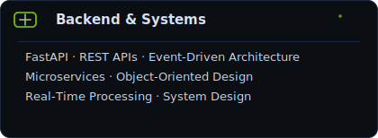
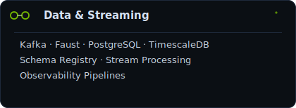
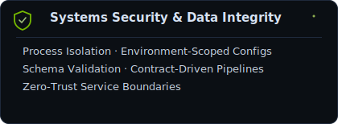
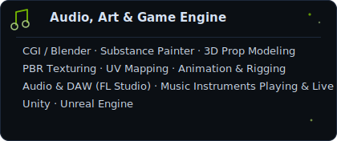
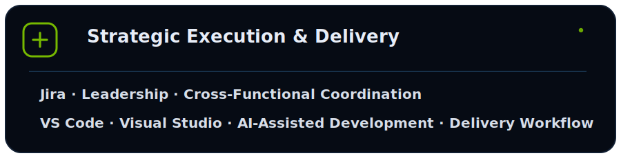

## I'm Zayed - Systems & SWE
ꜱᴏʟᴠɪɴɢ ᴘʀᴏʙʟᴇᴍꜱ ᴀᴛ ᴛʜᴇ ɪɴᴛᴇʀꜱᴇᴄᴛɪᴏɴ ᴏꜰ ʀᴇᴀʟ-ᴛɪᴍᴇ ᴄᴏɴꜱᴛʀᴀɪɴᴛꜱ ᴀɴᴅ ᴅɪꜱᴛʀɪʙᴜᴛᴇᴅ ꜱʏꜱᴛᴇᴍꜱ, ꜰʀᴏᴍ 60ꜰᴘꜱ ᴇᴍʙᴇᴅᴅᴇᴅ ᴄᴏɴᴛʀᴏʟ ꜱʏꜱᴛᴇᴍꜱ ᴛᴏ ꜱᴜʙ-ꜱᴇᴄᴏɴᴅ ꜱᴛʀᴇᴀᴍɪɴɢ ᴘʟᴀᴛꜰᴏʀᴍꜱ.
<table>
<tr>
<td width="100%">

<table align="center">
  <tr>
    <td align="center">
      
    </td>
    <td align="center">
      
    </td>
    <td align="center">
      
    </td>
  </tr>
</table>

  

 

 

  

  

    

      <b>▼ Explore Core Stack &amp; Creative Systems</b>
    

  

   

  

    
    
      
    
    
      
    
    
    
  

  

</td>
</tr>
</table>
