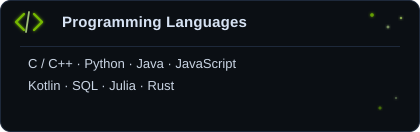
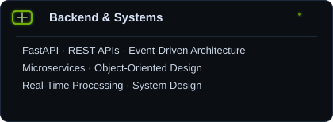
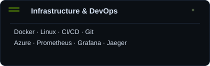
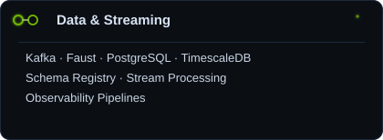
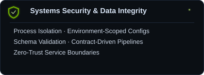
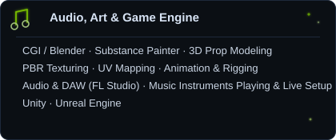
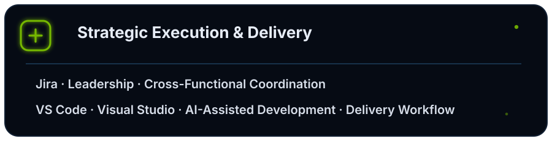
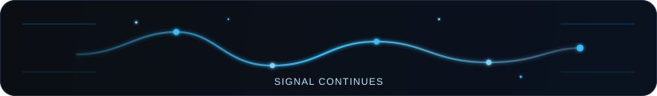

## I'm Zayed 

<table>
<tr>
<td width="100%">

<table align="center">
  <tr>
    <td align="center">
      
    </td>
    <td align="center">
      
    </td>
    <td align="center">
      
    </td>
  </tr>
</table>

  

 

 

  

    

      <b>▼ About</b>
    

  

   
  

    Systems & Software R&D engineer working in heterogeneous computing & real-time engine.  Experienced with sub-second latency AIOps platforms (Kafka, Faust, TimescaleDB) for high-velocity systems. Shipped a commercial Unity title on Steam and was a finalist in a 120+ competitor FinTech hackathon by architecting a novel payment solution MVP in 48 hours with business viability. Background with computer hardware, geospatial & high-fidelity graphic development,  strong with math & physics. Owning systems from stream ingestion to ML inference and solving problems at the intersection of real-time constraints and distributed platforms.
  

  

    

      <b>▼ Explore Core Stack &amp; Creative Systems</b>
    

  

   

  

    
    
      
    
    
      
    
    
    
  

  

</td>
</tr>
</table>
